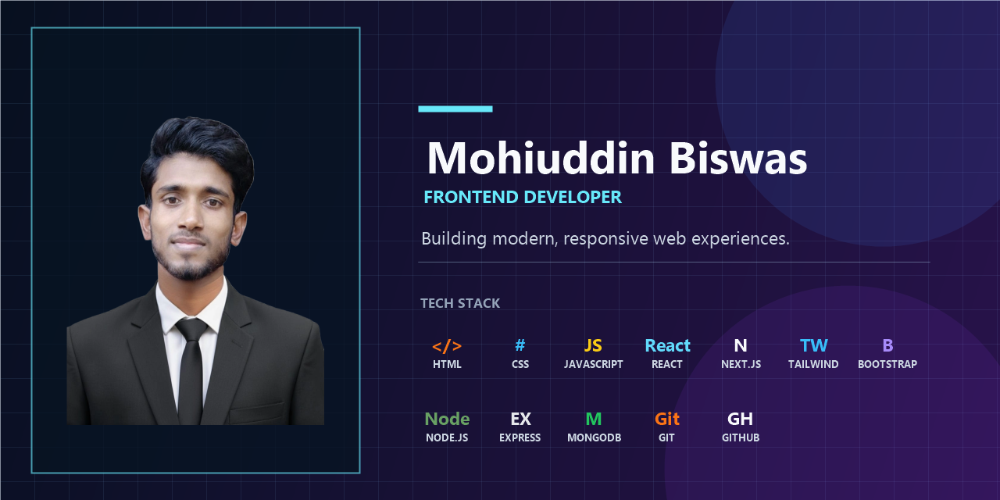

<h1 align="center">Hi 👋, I'm Muhammad Mohiuddin Biswas</h1>
<h3 align="center">Frontend Developer | UI/UX Enthusiast | Problem Solver</h3>

- 🔭 I’m currently working on [Hero-App](https://hero-app-sage.vercel.app/)

- 🌱 I’m currently learning **BetterAuth , MongoDB , Express-js** for backend.

- 💬 Ask me about **JavaScript , react , next-js** for checking me.

- 📫 How to reach me **mohimuddin714@gmail.com**

- ⚡ Fun fact **I think I am a lazy Programmer**

## <h3 align="left">Connect with me on social:</h3>

  
  
  
  

## 🛠️ Tech Stack  

### **Languages**

### **Css Frameworks & Libraries**

### **Javascript Frameworks & Libraries**

### **Database**

### **Deployment Platforms**

### **Design & Graphics**

### **Tools & Technologies**

## 🌐 Connect With Me  
<h3 align="left">Connect with me:</h3>

  
  
  
  

### **GitHub Statistics and Analysis**

  

  

  

---

## 📊 GitHub Stats  

| GitHub Stats | Most Used Languages |
| :---: | :---: |
|  
|  |

---

